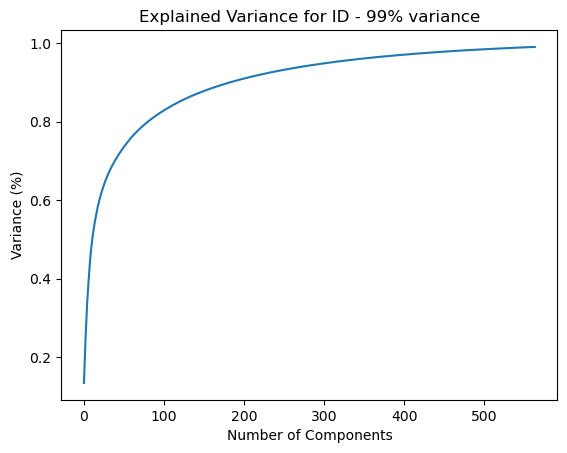
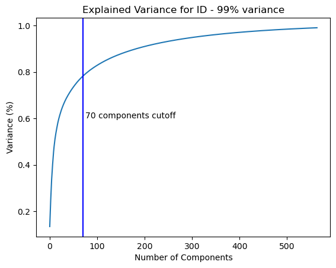
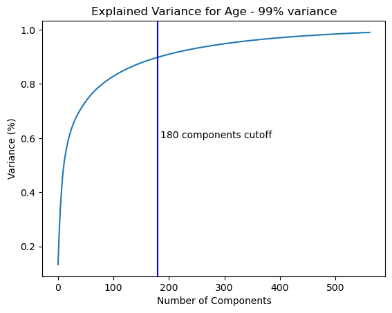
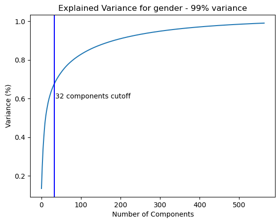
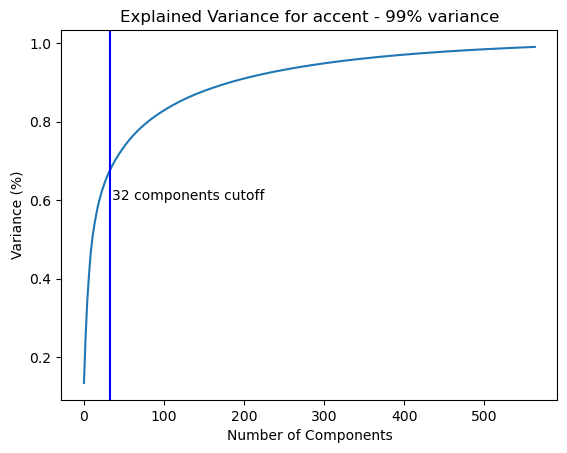

PCA of dataset 
 
 
Label 1 -> 
    Initial model 
        SVC  
        hyperparameters -> {kernel="rbf", C=20, gamma="scale"} 
        Valid set Accuracy:  0.9626666666666667 
        Precision, Recall and F1 Score: (0.9658712615443265, 0.9626666666666667, 0.9626405604263418, None) 
    After PCA 
     
        n_components = 70 
        SVC 
        hyperparameters -> {kernel="rbf", C=20, gamma="scale", degree=5} 
        Valid set Accuracy: 0.9346666666666666 
        Precision, Recall and F1 Score: (0.9378507574297047, 0.9346666666666666, 0.9346067555105009, None) 
 
Label 2 -> 
    After PCA 
     
        n_components = 180 
        SVC 
        hyperparameters ->  {'kernel': 'rbf', 'gamma': 'scale', 'degree': 5, 'C': 30} 
        Valid set Accuracy: 0.9334239130434783 
        Precision, Recall and F1 Score: (0.9356685266113715, 0.9334239130434783, 0.9333604351244102, None) 
 
Label 3 -> 
    After PCA 
     
        n_components = 32 
        SVC 
        hyperparameters -> {'C': 10} 
        Valid Set Accuracy: 0.9946666666666667 
        Precision, Recall and F1 Score: (0.9946607338017173, 0.9946666666666667, 0.9946521329001151, None) 
 
Label 4 -> 
    After PCA 
     
        n_components = 130 
        SVC 
        hyperparameters -> {'C': 10} 
        Valid Set Accuracy:  0.9733333333333334 
        Precision, Recall and F1 Score: (0.9738508140225787, 0.9733333333333334, 0.9726425543433834, None) 